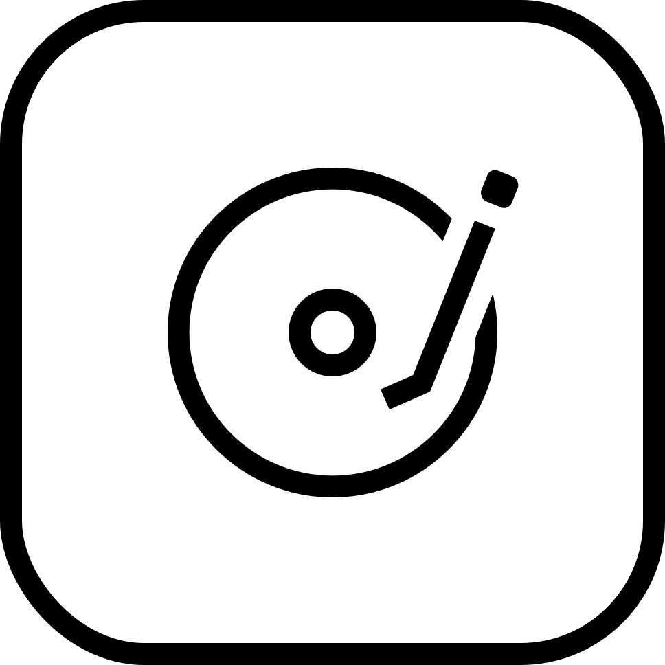

 

# CalmMusic

CalmMusic is a minimal, mindful music player built for de‑googled and E‑ink Android devices. It unifies your Apple Music catalog and your local audio files into a calm, distraction‑free listening experience powered by the Mudita Mindful Design library.

"Let's make technology useful again."

## Screenshots

<table>
<tr>
  <td></td>
  <td></td>
  <td></td>
  <td></td>
</tr>
<tr>
  <td></td>
  <td></td>
  <td></td>
  <td></td>
</tr>
<tr>
  <td></td>
  <td></td>
  <td></td>
  <td></td>
</tr>
<tr>
  <td></td>
  <td></td>
  <td></td>
  <td></td>
</tr>
<tr>
  <td></td>
  <td></td>
</tr>
</table>

## What is CalmMusic?

CalmMusic keeps music listening calm. It’s built with Kotlin and Jetpack Compose to prioritize your attention, privacy, and sense of ownership over your library. No accounts, no analytics, no growth hacks—just your music, your way.

It brings together:

- Your Apple Music catalog and playlists (via Apple MusicKit for Android + Web API)
- Your local audio files from folders you explicitly choose
- A unified, simple UI for browsing, queueing, and playing music

## Core principles (Mudita Mindful Design)

- **Simplicity:** One clear purpose per screen; no feature bloat
- **Privacy:** No tracking, no data monetization, no third‑party analytics
- **Intention:** Tools that support deliberate listening, not habit loops
- **Focus:** Clean UI that stays out of your way
- **Ownership:** Local files and playlists under your control

## Highlights

- **Unified library view**
  - Browse songs, albums, artists, and playlists in one place
  - Apple Music tracks and local files share the same library model

- **Apple Music integration**
  - Sign in with Apple Music using MusicKit for Android
  - Search the Apple Music catalog
  - Browse your Apple Music library songs and playlists
  - Play full tracks via Apple’s native playback controller

- **Local music support**
  - Choose folders via the Storage Access Framework (SAF)
  - Recursively scans supported audio files and reads tags (title, artist, album, duration, etc.)
  - Groups local music by artist and album with stable IDs

- **Playlists & queue**
  - Create and manage local playlists stored in a Room database
  - Unified playback queue for Apple Music and local songs
  - Shuffle and repeat modes that keep UI and players in sync

- **Mindful playback**
  - Focused Now Playing screen tuned for E‑ink readability
  - Simple playback controls without visual noise or dark patterns
  - Works well on low‑distraction, de‑googled devices

## Why it matters

- **Privacy‑respecting**
  - No analytics SDKs, no tracking, no ads
  - Settings and local library metadata are stored on‑device
  - Apple Music requests go directly from your device to Apple’s servers

- **Distraction‑free**
  - No algorithmic “engagement” feeds
  - No badges, streaks, or manipulative prompts
  - Just enough UI to find and enjoy your music

- **Resilient**
  - Local music continues to work without network access
  - Apple Music playback uses Apple’s official SDK for reliability

## Tech stack (for the curious)

- **Language:** Kotlin (Android, JVM target 1.8)
- **UI:** Jetpack Compose + Material 3 + Mudita Mindful Design (MMD)
- **Navigation:** Jetpack Navigation Compose
- **Architecture:** Compose‑first UI with state hoisted into `MainActivity` and exposed via UI models and flows
- **Persistence:** Room (songs, albums, artists, playlists) + SharedPreferences for lightweight settings
- **Local files:** Storage Access Framework (`DocumentFile`) for folder access and recursive scanning
- **Playback:**
  - Apple MusicKit for Android AARs (`appleMusicSDK` native library)
  - AndroidX Media3 ExoPlayer for local files in a foreground playback service
- **Networking:** Retrofit + Moshi + OkHttp for Apple Music Web API
- **Android:** Min SDK 28, Target/Compile SDK 35
- **Build system:** Gradle Kotlin DSL, single `:app` module with Compose enabled

## Privacy & data

- **No account required for local playback**
- **No third‑party analytics or tracking**
- **No data sent to any server controlled by the app author**
- **Apple Music:**
  - Uses your Apple Music developer token and music user token only to talk to Apple Music’s APIs
  - Tokens are stored locally and used solely for Apple Music features

### Local music behavior

- You explicitly choose which folders to index via the system file picker
- The app scans only those folders for supported audio files
- Extracted metadata (title, artist, album, etc.) is stored in a local Room database
- You can clear and rescan your local library at any time

## Roadmap

Planned and aspirational ideas, all subject to change:

- Richer Apple Music library support (recently played, more filters)
- Smarter playlist tools (reordering, duplicate detection)
- Additional playback options (gapless playback tuning, replay behavior)
- Deeper accessibility improvements (larger touch targets, contrast presets)
- More E‑ink friendly refinements (refresh strategies, typography tweaks)

## For developers

Want to build from source?

- **Requirements:**
  - Android Studio (Giraffe / Hedgehog or newer)
  - JDK 17 (Gradle is configured to use Java 17)
  - Android SDK Platform 35+
  - Device or emulator running Android 9 (API 28) or newer

- **Quick start:**
  1. Clone this repository
  2. Open the root folder in Android Studio
  3. Let Gradle sync and download dependencies
  4. Configure an Apple Music developer token (see `SimpleTokenProvider` and Apple’s MusicKit documentation) if you want Apple Music features
  5. Select the `app` run configuration and press **Run**

- **Useful Gradle commands (from repo root):**
  - Assemble debug APK: `./gradlew :app:assembleDebug`
  - Install debug build on a connected device: `./gradlew :app:installDebug`
  - Run unit tests: `./gradlew :app:testDebugUnitTest`
  - Run instrumentation tests: `./gradlew :app:connectedDebugAndroidTest`
  - Run Android Lint: `./gradlew :app:lintDebug`

Apple Music integration will not function correctly unless you provide valid Apple Music credentials and follow Apple’s developer policies.

## Contributing

Contributions are welcome—as long as they respect the core principles of simplicity, privacy, and focus.

If you open a pull request:

- Keep UI changes mindful of E‑ink devices (contrast, motion, density)
- Avoid adding tracking, ads, or dark patterns
- Test on at least one real or virtual device on a supported Android version

## License

License details are not finalized yet. Until a license file is added, please treat this repository as **all rights reserved** by the author and ask before redistributing or publishing modified builds.
